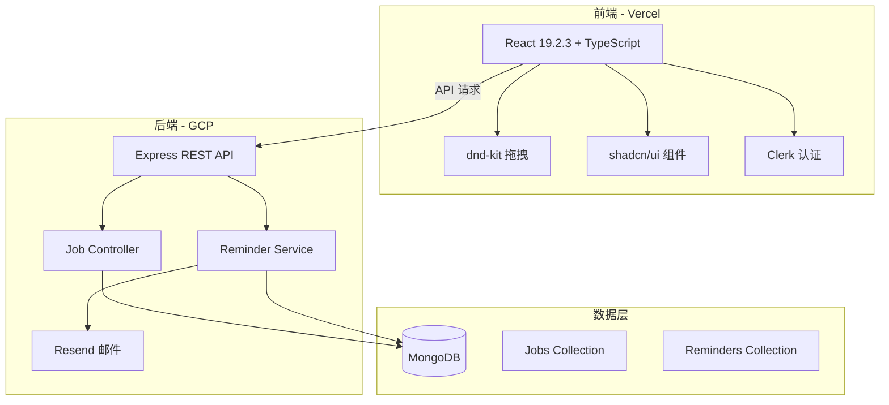

# Job Application Tracker 实现计划

## 项目架构



## 技术栈总览

**前端**

- React 19.2.3 (安全版本) + TypeScript
- Vite (快速构建)
- dnd-kit (拖拽交互)
- shadcn/ui + Tailwind CSS (UI组件)
- Clerk (用户认证)
- React Query / TanStack Query (数据管理)
- Zustand (状态管理)
- React Router v6 (路由)
- **react-i18next (国际化 - 中英文双语)**

**后端**

- Node.js + Express + TypeScript
- MongoDB + Mongoose (数据库)
- Clerk SDK (后端认证验证)
- Resend (邮件服务)
- node-cron (定时任务)
- Zod (数据验证)

**部署**

- 前端: Vercel
- 后端: Google Cloud Platform (Cloud Run 或 Compute Engine)
- 数据库: MongoDB Atlas

## 核心功能模块

### 1. 项目初始化

**前端项目结构**

```
frontend/
├── src/
│   ├── components/
│   │   ├── ui/          # shadcn/ui 组件
│   │   ├── kanban/      # 看板相关组件
│   │   ├── jobs/        # 职位管理组件
│   │   └── analytics/   # 数据分析组件
│   ├── hooks/           # 自定义 hooks
│   ├── lib/             # 工具函数
│   ├── services/        # API 服务
│   ├── stores/          # Zustand stores
│   ├── types/           # TypeScript 类型定义
│   ├── locales/         # 国际化翻译文件
│   │   ├── en/
│   │   │   └── translation.json
│   │   └── zh/
│   │       └── translation.json
│   └── pages/           # 页面组件
├── package.json
└── vite.config.ts
```

**后端项目结构**

```
backend/
├── src/
│   ├── controllers/     # 控制器
│   ├── models/          # Mongoose 模型
│   ├── routes/          # 路由定义
│   ├── services/        # 业务逻辑
│   ├── middleware/      # 中间件（认证等）
│   ├── utils/           # 工具函数
│   ├── types/           # TypeScript 类型
│   └── jobs/            # 定时任务
├── package.json
└── tsconfig.json
```

### 2. 数据模型设计

**Job Application Schema (MongoDB)**

```typescript
{
  _id: ObjectId,
  userId: string,           // Clerk user ID
  companyName: string,
  position: string,
  jobUrl?: string,
  jobDescription?: string,
  status: "applied" | "interviewing" | "offer" | "rejected",
  appliedDate: Date,
  salary?: string,
  location?: string,
  contactInfo: {
    hrName?: string,
    hrEmail?: string,
    hrPhone?: string
  },
  interviews: [{
    date: Date,
    type: string,          // 电话、视频、现场
    notes?: string,
    feedback?: string
  }],
  notes?: string,
  tags?: string[],
  createdAt: Date,
  updatedAt: Date
}
```

**Reminder Schema**

```typescript
{
  _id: ObjectId,
  userId: string,
  jobId: ObjectId,
  reminderDate: Date,
  message: string,
  type: "follow_up" | "interview" | "custom",
  status: "pending" | "sent" | "dismissed",
  notificationChannels: ["email", "in_app"],
  createdAt: Date
}
```

### 3. 核心功能实现

#### 3.0 国际化 (i18n)

**实现方案**:

使用 `react-i18next` 和 `i18next` 实现中英文双语切换：

- 配置 i18next 实例
- 创建翻译文件 (`en/translation.json` 和 `zh/translation.json`)
- 语言切换器组件（顶部导航栏）
- 持久化用户语言偏好（localStorage）
- 所有 UI 文本、表单标签、通知消息都支持双语

**翻译文件结构示例**:

```json
{
  "nav": {
    "dashboard": "Dashboard / 仪表板",
    "kanban": "Kanban / 看板",
    "analytics": "Analytics / 数据分析"
  },
  "status": {
    "applied": "Applied / 已投递",
    "interviewing": "Interviewing / 面试中",
    "offer": "Offer / 已获Offer",
    "rejected": "Rejected / 已拒绝"
  },
  "form": {
    "companyName": "Company Name / 公司名称",
    "position": "Position / 职位"
  }
}
```

**关键组件**:

- `LanguageSwitcher.tsx`: 语言切换按钮
- `i18n.ts`: i18next 配置文件
- 使用 `useTranslation()` hook 在组件中获取翻译

#### 3.1 看板视图 (Kanban)

使用 dnd-kit 实现四列看板：

- **已投递 (Applied)**: 刚提交申请
- **面试中 (Interviewing)**: 收到面试邀请
- **Offer**: 拿到offer
- **被拒 (Rejected)**: 被拒绝

**关键组件**:

- `KanbanBoard.tsx`: 主看板容器
- `KanbanColumn.tsx`: 单列组件
- `JobCard.tsx`: 职位卡片（可拖拽）
- 拖拽后触发 API 更新状态

#### 3.2 信息记录与管理

**功能点**:

- 创建/编辑职位申请表单
- 富文本编辑器记录 JD (使用 Tiptap 或 Lexical)
- 面试记录时间线
- HR 联系方式管理
- 文件附件上传 (简历、offer letter)

**关键组件**:

- `JobForm.tsx`: 职位表单
- `InterviewTimeline.tsx`: 面试时间线
- `NotesEditor.tsx`: 笔记编辑器

#### 3.3 数据分析

计算并可视化：

- **投递回复率**: (面试中 + Offer + 被拒) / 总投递
- **面试转化率**: Offer / 面试中
- **平均响应时间**: 从投递到首次面试的平均时间
- **状态分布**: 饼图展示各阶段职位数量
- **投递趋势**: 时间线图展示投递活跃度

**关键组件**:

- `AnalyticsDashboard.tsx`: 分析仪表板
- 使用 Recharts 或 Chart.js 可视化

#### 3.4 双重提醒功能

**实现方案**:

**后端定时任务** (node-cron):

- 每小时检查待发送提醒
- 发送邮件 (Resend API)
- 更新提醒状态

**应用内通知**:

- 登录时拉取未读提醒
- 顶部通知横幅
- 通知中心页面

**关键组件**:

- `ReminderService.ts` (后端): 提醒逻辑
- `NotificationBell.tsx` (前端): 通知图标
- `NotificationCenter.tsx`: 通知中心

### 4. API 端点设计

**Job Routes** (`/api/jobs`)

```
GET    /api/jobs              # 获取用户所有职位
POST   /api/jobs              # 创建新职位
GET    /api/jobs/:id          # 获取单个职位详情
PUT    /api/jobs/:id          # 更新职位
DELETE /api/jobs/:id          # 删除职位
PATCH  /api/jobs/:id/status   # 更新职位状态（拖拽）
POST   /api/jobs/:id/interview # 添加面试记录
```

**Analytics Routes** (`/api/analytics`)

```
GET    /api/analytics/stats   # 获取统计数据
GET    /api/analytics/trends  # 获取趋势数据
```

**Reminder Routes** (`/api/reminders`)

```
GET    /api/reminders         # 获取用户提醒
POST   /api/reminders         # 创建提醒
PUT    /api/reminders/:id     # 更新提醒
DELETE /api/reminders/:id     # 删除提醒
PATCH  /api/reminders/:id/dismiss # 标记已读
```

### 5. 认证流程 (Clerk)

**前端**:

- 使用 `@clerk/clerk-react`
- `<ClerkProvider>` 包裹应用
- 保护路由使用 `<SignedIn>` / `<SignedOut>`

**后端**:

- 使用 `@clerk/clerk-sdk-node`
- 中间件验证 JWT token
- 从 token 提取 userId

### 6. 部署配置

**前端 (Vercel)**:

- 连接 GitHub 仓库
- 配置环境变量:
  - `VITE_API_URL`
  - `VITE_CLERK_PUBLISHABLE_KEY`
- 自动 CI/CD

**后端 (GCP Cloud Run)**:

- Dockerfile 容器化
- 配置环境变量:
  - `MONGODB_URI`
  - `CLERK_SECRET_KEY`
  - `RESEND_API_KEY`
  - `PORT`
- 设置 Cloud Build 触发器

**MongoDB Atlas**:

- 创建 M0 免费集群
- 配置网络访问（允许 GCP IP）
- 获取连接字符串

## 实现步骤

### Phase 1: 项目基础搭建

- 初始化前端项目 (Vite + React + TypeScript)
- 初始化后端项目 (Express + TypeScript)
- 配置 shadcn/ui 和 Tailwind CSS
- 设置 ESLint 和 Prettier
- 配置 MongoDB 连接

### Phase 2: 认证系统与国际化

- 配置 i18next 和 react-i18next
- 创建中英文翻译文件基础结构
- 实现语言切换器组件
- 集成 Clerk 到前端
- 实现后端认证中间件
- 创建受保护路由
- 实现登录/注册页面（支持双语）

### Phase 3: 核心功能 - 看板系统

- 设计 Job 数据模型
- 实现后端 CRUD API
- 创建看板 UI 组件（支持双语）
- 集成 dnd-kit 拖拽功能
- 实现状态更新逻辑
- 完善所有看板相关的翻译

### Phase 4: 信息管理

- 实现职位表单（创建/编辑，支持双语）
- 添加面试记录功能
- 实现笔记编辑器
- 添加 HR 联系方式管理
- 完善表单验证错误的双语提示

### Phase 5: 数据分析

- 实现后端统计计算逻辑
- 创建分析 API 端点
- 设计分析仪表板 UI（图表标签支持双语）
- 集成图表库展示数据
- 完善分析模块的翻译

### Phase 6: 提醒系统

- 设计 Reminder 数据模型
- 实现提醒 CRUD API
- 集成 Resend 邮件服务（支持中英文邮件模板）
- 实现 node-cron 定时任务
- 创建应用内通知 UI（支持双语）
- 实现通知中心
- 完善提醒相关的翻译

### Phase 7: 优化与部署

- 添加加载状态和错误处理
- 实现响应式设计（移动端适配）
- 性能优化（代码分割、懒加载）
- 编写 Dockerfile
- 配置 Vercel 部署
- 配置 GCP Cloud Run 部署
- 设置 MongoDB Atlas

### Phase 8: 测试与文档

- 编写 API 测试
- 编写组件测试
- 创建 README 文档
- 准备演示数据

## 关键技术决策

1. **dnd-kit vs react-beautiful-dnd**: 选择 dnd-kit 因为更现代、TypeScript 支持更好且持续维护
2. **shadcn/ui**: 基于 Radix UI，可定制性强，样式完全控制
3. **Clerk**: 开箱即用的认证方案，支持多种登录方式，免费额度足够个人项目
4. **Resend**: 现代邮件 API，开发体验好，免费额度每月 100 封
5. **MongoDB Atlas**: 免费 M0 集群，512MB 存储，适合小型应用
6. **Vercel + GCP**: 前端 Vercel 零配置部署，后端 GCP 灵活性高
7. **react-i18next**: React 生态最成熟的国际化方案，支持命名空间、懒加载、TypeScript

## 预期时间线

- Phase 1-2: 1-2 天（项目搭建和认证）
- Phase 3-4: 2-3 天（核心看板和信息管理）
- Phase 5: 1 天（数据分析）
- Phase 6: 2 天（提醒系统）
- Phase 7: 1-2 天（部署和优化）
- Phase 8: 1 天（测试和文档）

**总计**: 约 8-11 天开发时间